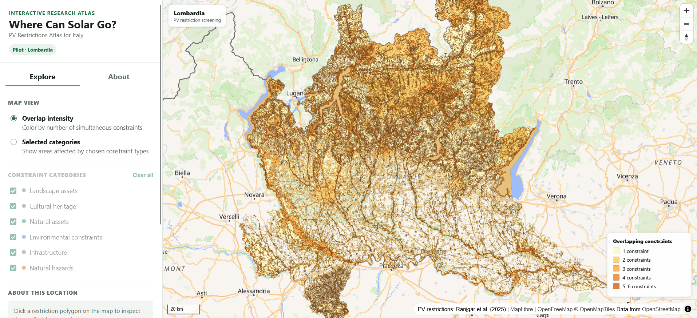

# Where Can Solar Go? — PV Restrictions Atlas for Italy

> **Pilot release: Lombardia**

An interactive GIS atlas for exploring regulatory, environmental, landscape,
cultural, infrastructural, and natural-hazard constraints affecting
ground-mounted photovoltaic development in Italy.

🌐 **[Explore the Live Atlas](https://babak-rj-az.github.io/italy-pv-restrictions-atlas/)**  
📄 **[Read the Research Paper](https://doi.org/10.3390/solar5030040)**



---

## About the Project

Where can utility-scale solar photovoltaic plants be developed when regulatory, environmental, landscape, cultural, infrastructural, and natural-hazard constraints are considered simultaneously?

This project transforms the national-scale GIS analysis developed in:

> Ranjgar, B.; Niccolai, A.; Leva, S.  
> **Where Can Solar Go? Assessing Land Availability for PV in Italy Under Regulatory Constraints.**  
> *Solar* **2025**, *5*(3), 40.  
> https://doi.org/10.3390/solar5030040

into an interactive and reusable geospatial resource.

The original research constructed a national GIS framework for identifying areas subject to PV development restrictions across Italy. The framework integrates six major categories of exclusion constraints derived from regulations, official geospatial datasets, and the scientific literature.

The goal of this repository is to extend those research outputs beyond static maps and figures by providing:

- an interactive web atlas;
- transparent documentation of the geospatial workflow;
- exploration of overlapping PV restrictions;
- eventually, GIS-ready datasets that researchers, planners, energy analysts, and decision makers can use in their own environments.

The current public release is a **pilot implementation for Lombardia**. National coverage is under development.

---

## 🗺️ Interactive Atlas

The pilot atlas allows users to explore PV development restrictions across Lombardia directly in the browser.

### Overlap Intensity

The default map represents the number of restriction categories affecting each location.

Areas can be affected by one or several simultaneous constraints, allowing the spatial concentration of restrictions to be explored visually.

### Selected Categories

Users can independently display:

- Landscape assets
- Cultural heritage
- Natural assets
- Environmental constraints
- Infrastructure
- Natural hazards

Each category has its own map symbology and can be switched on or off interactively.

### Location Inspection

Clicking a restricted area reports:

- whether the location falls within the restriction dataset;
- the number of overlapping constraint categories;
- the active constraint categories;
- the corresponding constraint combination.

---

# PV Restriction Framework

Six major categories of exclusion factors were considered.

| Code | Constraint category | Main components |
|---|---|---|
| `LA` | Landscape assets | Water/coastal buffers, wetlands, parks and reserves, wooded areas, altimetric zones, volcanic areas |
| `CH` | Cultural heritage | Protected cultural assets and UNESCO-related heritage features |
| `NA` | Natural assets | EUAP, Natura 2000, Important Bird Areas (IBA), Ramsar wetlands |
| `EC` | Environmental constraints | Fault lines, lakes and rivers |
| `INF` | Infrastructure | Dams, urban areas, roads, railways and powerlines |
| `NH` | Natural hazards | Areas highly susceptible to flood and landslide hazards |

Some spatial features require exclusion buffers based on regulatory provisions or criteria identified in the literature.

Examples include:

| Feature | Applied distance |
|---|---:|
| Cultural heritage features | 500 m |
| Active fault areas | 500 m |
| Lakes and rivers | 10 m |
| Dams | 100 m |
| Urban settlements | 100 m |
| Primary and secondary roads | 60 m |
| Railways | 30 m |
| High- to medium-voltage powerlines | 15 m |
| Watercourses | 150 m |
| Sea and lake shorelines | 300 m |

Landscape constraints also include elevation-related restrictions, including areas above specified thresholds for the Alps, Apennines, and island reliefs.

For the complete methodological justification and regulatory discussion, refer to the associated publication.

---

# Data Sources

The national analysis combines spatial information from several authoritative and open geospatial sources.

## Natural Assets

Natural protected areas were obtained from the Italian Ministry of the Environment and Energy Security (MASE).

Four major feature groups were considered:

- Official List of Protected Areas (EUAP)
- Natura 2000 Network
- Important Bird Areas (IBA)
- Ramsar wetlands

Source:

**MASE — Geoportale Nazionale / Nature**

https://gn.mase.gov.it/portale/en/web/geoportale-mase/nature

---

## Landscape Assets

Landscape constraints were obtained through the **Environmental and Landscape Territorial Information System (SITAP)** of the Italian Ministry of Culture.

The extracted layers include:

- water and coastal buffer areas;
- wetlands;
- parks and reserves;
- wooded areas;
- altimetric zones;
- volcanic areas.

Source:

**SITAP — Ministero della Cultura**

https://sitap.cultura.gov.it/

---

## Cultural Heritage

Cultural heritage information was obtained through **Vincoli in Rete**, managed by the Italian Ministry of Culture.

The service provides:

- point features;
- line features;
- polygon features.

Applicable exclusion buffers were subsequently applied during GIS processing.

Source:

**Vincoli in Rete**

http://vincoliinrete.beniculturali.it/

---

## Natural Hazards

Flood- and landslide-prone areas were obtained from the Italian Institute for Environmental Protection and Research (ISPRA) through the **IdroGEO** open-data platform.

Source:

**ISPRA — IdroGEO**

https://idrogeo.isprambiente.it/app/page/open-data

---

## Infrastructure and Environmental Features

Infrastructure and selected environmental features were obtained from **OpenStreetMap (OSM)**.

These include features such as:

- roads;
- railways;
- powerlines;
- dams;
- urban areas;
- rivers and lakes;
- fault-related spatial information used in the analysis.

Appropriate exclusion buffers were subsequently applied according to the methodological framework.

---

# Data Acquisition Workflow

The source datasets were not distributed through a single common interface. Different acquisition strategies were therefore required.

## Direct Geospatial Downloads

Natural-hazard datasets were downloaded as GIS files from the ISPRA/IdroGEO open-data infrastructure.

The national hazard source data alone consisted of several gigabytes of spatial information.

---

## OpenStreetMap Extraction

Infrastructure and selected environmental features were extracted from OpenStreetMap.

The relevant feature classes were subsequently processed and buffered according to their corresponding exclusion criteria.

---

## MASE ArcGIS Services

Natural-asset datasets were retrieved from MASE geospatial services as JSON feature data.

Because some feature classes exceeded the number of features that could be retrieved in a single request, multiple requests were required to obtain the complete datasets.

The resulting features were subsequently converted and integrated into the GIS processing environment.

---

## SITAP WMS Extraction

The SITAP landscape datasets required a different acquisition procedure.

Features were retrieved from the available WMS services and stored as KML data.

For large feature classes, querying the entire national extent in a single request was not practical. A spatial grid was therefore generated over Italy and automated requests were performed for individual grid cells.

The resulting KML files were subsequently converted into geodatabase feature classes and assembled for further processing in ArcGIS Pro.

---

## Vincoli in Rete Extraction

A similar grid-based acquisition strategy was used for cultural-heritage data from Vincoli in Rete.

Point, line, and polygon cultural-heritage features were retrieved through spatially partitioned requests and converted from KML for subsequent GIS processing.

Buffers were then applied where required by the adopted methodology.

---

# GIS Processing Workflow

Most of the national geospatial processing was performed in **ArcGIS Pro**.

The general workflow was:

```text
Source datasets
      │
      ▼
Data cleaning and conversion
      │
      ▼
Required exclusion buffers
      │
      ▼
Individual restriction feature classes
      │
      ▼
Merge within each thematic category
      │
      ▼
Dissolve
      │
      ├───────────────┐
      ▼               ▼
6 thematic       Union analysis
constraint       between the
layers           6 categories
      │               │
      ▼               ▼
Final national    Restriction
restriction       combinations
footprint
      │
      ▼
PV available land
```

After preprocessing, the individual restriction features were merged into six major thematic datasets:

```text
Landscape Assets
Cultural Heritage
Natural Assets
Environmental Constraints
Infrastructure
Natural Hazards
```

Each thematic dataset was dissolved to remove unnecessary internal boundaries.

Two main analytical paths were then followed.

### 1. Total Restricted Area

The six thematic constraint datasets were combined and dissolved to construct the overall PV exclusion footprint.

This represents land affected by at least one of the considered restriction categories.

### 2. Restriction Combination Analysis

A union analysis was performed between the six thematic layers.

This preserves the combinations of overlapping constraints and allows locations to be classified according to which restriction categories occur simultaneously.

The resulting union dataset forms the principal spatial basis of the interactive atlas.

---

# From Desktop GIS to the Web

The original national GIS workspace contains many large and highly detailed datasets. Publishing the original GIS geometries directly to a browser is therefore impractical.

The web-atlas workflow was developed to preserve useful spatial detail while making interactive delivery feasible.

The Lombardia pilot was used to develop and validate this workflow.

## 1. Regional Prototype

The national union dataset was clipped to Lombardia.

The initial regional dataset remained geometrically complex and contained hundreds of thousands of polygon components.

## 2. Geometry Preparation

The processing included:

- multipart-to-singlepart conversion;
- calculation of geodetic polygon area;
- removal of very small polygon fragments below **0.001 km²**;
- dissolution based on the six restriction indicators;
- geometry simplification using a **1 m tolerance**.

Several simplification tolerances were experimentally evaluated before selecting the 1 m version for the pilot. Also, removal of small polygons did not contribute much to geometry and file size simplification. Therefore, on the final pubishing procedure, only a 1 m simplification was applied.

The objective was to reduce web-delivery complexity while retaining close visual correspondence with the original GIS geometry.

## 3. Web Attribute Model

The web dataset was reduced to the attributes required by the atlas:

| Field | Meaning |
|---|---|
| `LA` | Landscape assets |
| `CH` | Cultural heritage |
| `NA` | Natural assets |
| `EC` | Environmental constraints |
| `INF` | Infrastructure |
| `NH` | Natural hazards |
| `N_CONSTR` | Number of overlapping restriction categories |
| `COMBO` | Combination of active restriction categories |

The six thematic fields are binary indicators.

For example:

```text
LA = 1
CH = 0
NA = 1
EC = 0
INF = 1
NH = 0
```

corresponds to a location affected by three thematic constraint categories.

## 4. FlatGeobuf Intermediate

The cleaned GIS layer was converted to **WGS 84 (EPSG:4326)** and exported to FlatGeobuf.

FlatGeobuf provides an open and efficient intermediate format between the desktop GIS workflow and the vector-tile generation environment.

## 5. Vector Tile Generation

The FlatGeobuf dataset was processed using **Tippecanoe** under WSL2.

Vector tiles were generated for zoom levels appropriate to the regional pilot and packaged into a single **PMTiles** archive.

For the Lombardia pilot, this reduced the web-distribution asset to approximately **45 MB**, while allowing the browser to retrieve only the required tile ranges during map interaction.

## 6. PMTiles Delivery

Rather than hosting thousands of individual vector-tile files, the atlas uses a single PMTiles archive.

PMTiles supports HTTP byte-range requests, allowing the browser to retrieve only the portions of the archive required for the current map extent and zoom level.

This architecture is particularly useful for a static deployment because it does not require a dedicated tile server.

## 7. Web Visualization

The interactive frontend is built using:

- **MapLibre GL JS** — interactive web mapping;
- **PMTiles** — serverless vector-tile archive;
- **OpenFreeMap** — basemap;
- HTML, CSS and JavaScript — interface and interaction;
- **GitHub Pages** — static hosting.

The production deployment was verified to serve PMTiles requests using HTTP `206 Partial Content` responses.

---

# Repository Structure

```text
italy-pv-restrictions-atlas/
│
├── index.html
├── README.md
├── range_server.py
│
├── css/
│   └── style.css
│
├── js/
│   └── app.js
│
└── data/
    └── Lombardia_PV_Restrictions_test.pmtiles
```

`range_server.py` is provided for local development because PMTiles requires HTTP byte-range support.

The deployed GitHub Pages site does not require the Python server.

---

# Running the Atlas Locally

Clone the repository:

```bash
git clone https://github.com/Babak-RJ-AZ/italy-pv-restrictions-atlas.git
cd italy-pv-restrictions-atlas
```

Run the included range-enabled development server:

```bash
python range_server.py
```

Then open:

```text
http://localhost:8000
```

Do not open `index.html` directly from the filesystem, as PMTiles should be accessed through an HTTP server supporting byte-range requests.

---

# Current Status

### Lombardia pilot

- [x] Six-category restriction dataset
- [x] Overlap-intensity visualization
- [x] Interactive category selection
- [x] Location-based restriction inspection
- [x] PMTiles vector-tile delivery
- [x] Responsive web interface
- [x] GitHub Pages deployment

### Planned national release

- [ ] Extend optimized vector tiles to all Italian regions
- [ ] National interactive atlas
- [ ] Regional navigation and statistics
- [ ] GIS-ready downloadable datasets
- [ ] Data dictionary and metadata
- [ ] Versioned dataset release
- [ ] Zenodo archival
- [ ] DOI for the atlas/data release

---

# Citation

## Scientific Methodology

If you use the methodology or scientific results underlying this project, please cite:

> **Ranjgar, B.; Niccolai, A.; Leva, S.**  
> Where Can Solar Go? Assessing Land Availability for PV in Italy Under Regulatory Constraints.  
> *Solar* **2025**, *5*, 40.  
> https://doi.org/10.3390/solar5030040

### BibTeX

```bibtex
@article{ranjgar2025where,
  author  = {Ranjgar, Babak and Niccolai, Alessandro and Leva, Sonia},
  title   = {Where Can Solar Go? Assessing Land Availability for PV in Italy Under Regulatory Constraints},
  journal = {Solar},
  year    = {2025},
  volume  = {5},
  number  = {3},
  article = {40},
  doi     = {10.3390/solar5030040}
}
```

## Atlas and Data

The interactive atlas and GIS-ready datasets are an ongoing extension of the published research.

A dedicated citation will be provided after the first versioned geospatial dataset is archived on **Zenodo** and assigned a DOI.

Until then, users of the atlas should cite the underlying publication above and acknowledge this repository:

```text
https://github.com/Babak-RJ-AZ/italy-pv-restrictions-atlas
```

---

# Licensing

## Source Code

The original software developed for this repository is intended to be released under a permissive open-source license.

An explicit software license will be added separately.

## Geospatial Data

**No independent license is currently granted for redistribution or reuse of the derived geospatial dataset contained in this pilot release.**

The restriction dataset integrates information derived from several upstream geospatial sources with potentially different licensing and attribution requirements.

Before the national GIS-ready dataset is released, the licensing and reuse conditions of the contributing data sources will be reviewed individually.

This includes, among others:

- OpenStreetMap;
- ISPRA / IdroGEO;
- MASE geospatial services;
- SITAP / Italian Ministry of Culture;
- Vincoli in Rete / Italian Ministry of Culture.

Following this review, an appropriate license will be assigned to the derived geospatial products before their formal release and archival on Zenodo.

The license of the associated scientific publication does not automatically determine the licensing conditions of the underlying or derived geospatial databases.

---

# Disclaimer

This atlas is intended for **research, communication, and preliminary spatial screening**.

The mapped restrictions should not be interpreted as a definitive legal determination of whether a photovoltaic installation can or cannot be authorized at a particular location.

The atlas does **not** replace:

- official planning instruments;
- cadastral verification;
- environmental assessment;
- landscape or cultural-heritage assessment;
- grid-connection studies;
- site-specific technical investigation;
- consultation with competent authorities;
- formal permitting procedures.

Source datasets may differ in spatial resolution, temporal currency, completeness, and positional accuracy.

In addition, the geometries used by the web atlas have undergone processing and simplification to enable efficient browser visualization.

Users requiring authoritative information should consult the corresponding official datasets and competent public authorities.

---

# Acknowledgements

This project builds upon geospatial information provided by Italian public institutions and open-data initiatives, including:

- Italian Ministry of the Environment and Energy Security (MASE);
- Italian Ministry of Culture (MiC);
- ISPRA and the IdroGEO platform;
- SITAP;
- Vincoli in Rete;
- OpenStreetMap contributors.

The research underlying the atlas was conducted at **Politecnico di Milano**.

---

## Authors

**Babak Ranjgar**  
**Alessandro Niccolai**  
**Sonia Leva**

Research basis: *Where Can Solar Go? Assessing Land Availability for PV in Italy Under Regulatory Constraints*.
